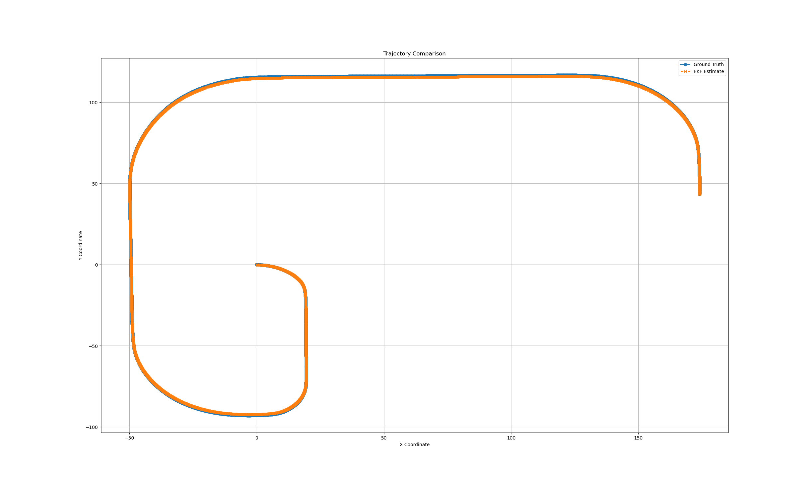

# Extended Kalman Filter (EKF) for Vehicle State Estimation

## Overview

This project implements an Extended Kalman Filter (EKF) for estimating the state of a vehicle using GNSS and IMU data in a simulation environment, such as the CARLA simulator. The EKF estimates the vehicle's position, velocity, orientation, and yaw rate by combining noisy sensor measurements and a non-linear motion model.

## Features

* State Estimation: Estimates a state vector with the following components:
    * x,y: Vehicle's position in Cartesian coordinates.
    * v: Velocity of the vehicle.
    * ψ: Orientation (yaw angle) of the vehicle.
    * ψ˙: Yaw rate.

* Sensor Fusion: Combines GNSS (position) and IMU (acceleration and yaw rate) data for improved accuracy.

* Non-linear Dynamics: Utilizes the EKF framework to handle the non-linear motion model of the vehicle.

## Usage

### Initialization

```python
    import numpy as np

    # Define initial values
    initial_state = np.zeros(5)  # [x, y, velocity, orientation, yaw_rate]
    initial_covariance = np.eye(5) * 0.1
    process_noise = np.eye(5) * 0.01
    measurement_noise = np.eye(2) * 0.1

    # Create the EKF instance
    ekf = EKF(initial_state, initial_covariance, process_noise, measurement_noise)
```

### Prediction Step

```python
    dt = 0.1  # Time step in seconds
    accel = [1.0, 0.0]  # Example acceleration [ax, ay]
    gyro = [0.0, 0.0, 0.05]  # Example yaw rate [ωx, ωy, ωz]

    ekf.predict(dt, accel, gyro)
```

### Update Step

```python
    def measurement_function(state):
        # GNSS provides position [x, y]
        return np.array([state[0], state[1]])

    def measurement_jacobian(state):
        # Jacobian of measurement function for GNSS
        H = np.zeros((2, 5))
        H[0, 0] = 1  # ∂z_x/∂x
        H[1, 1] = 1  # ∂z_y/∂y
        return H

    gnss_measurement = [5.0, 2.0]  # Example GNSS data [x, y]
    ekf.update(gnss_measurement, measurement_function, measurement_jacobian)
```

## Example Application

The EKF is integrated into a CARLA simulation to estimate the vehicle's trajectory and compare it with ground truth:

* GNSS data is used for x and y positions.
* IMU data is used for acceleration and yaw rate.
* The estimated trajectory is logged and compared to the ground truth.

## Dependencies

* Python 3.8+
* Numpy
* CARLA simulator (for integration)


## Results

Comparing the results did with saving the calculated trajectory and ground truth datas. Sved datas are opened with mathplotlib to visualize differences.


Occasion kalman filter and ground truth outputs


Extended kalman filter and ground truth outputs (In short distance)


Extended kalman filter and ground truth outputs (In medium distance)


Extended kalman filter and ground truth outputs (In long distance)
