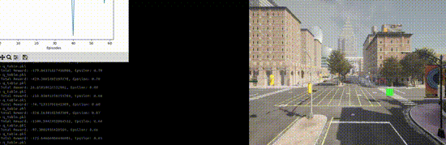
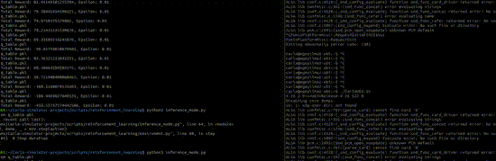

# CARLA Reinforcement Learning Parking Project

## Project Overview
This project demonstrates the use of basic reinforcement learning (RL) to control a vehicle in the CARLA simulator. The goal is for the vehicle to park at a specified location while avoiding collisions. The project implements a Q-learning algorithm, trains the agent, and provides an inference mode to control the vehicle using the trained model.

## Features
1. Custom RL Environment:

    * The environment uses the CARLA simulator.
    * State: The x and y coordinates of the vehicle.
    * Actions: Throttle and steering inputs.
    * Rewards:
        * Positive for reaching the goal.
        * Negative for collisions.
        * Penalized based on distance from the goal.

2. Q-Learning:
    * Discretizes the continuous state and action spaces for compatibility with Q-learning.
    * Saves and loads the Q-table for efficient training and inference.

3. Inference Mode:
    * Allows the agent to control the vehicle using a pre-trained Q-table without retraining.

## Prerequisites
* CARLA Simulator was used to simulate enviroment. used carla version is 09.15
* Python 3.8 or above

```bash
pip install carla numpy pickle
```

## Project Structure
    .
    ├── main.py           # Main script to train 
    ├── interence_mode.py # Inference mode to run already trained model 
    ├── CarlaParkingEnv   # Custom CARLA environment class
    ├── QLearningAgent    # Q-learning agent implementation
    ├── q_table.pkl       # Saved Q-table (generated after training)
    └── README.md         # Project documentation

### Saving and Loading Q-Table
* Saving: The Q-table is saved automatically after each episode during training.
* Loading: During inference mode, the saved Q-table is loaded and used for action selection.

# Results
There are some giffs to demonstrate first iteration and inference mode in the carla.

This is first episodes on the simulation.



In the inference mode, vehicle succesfully reaches the target.




### TODOs
* Implement Deep Q-Learning for continuous state-action spaces.
* Add obstacle avoidance capabilities.
* Use policy-gradient methods like PPO for better generalization.

## Details of The Reinforcement Learning Theory In This Project.

**Q-Learning Update Rule**

The Q-value for a given state s  and action a is updated as follows:

$$
Q(s,a)←Q(s,a)+α[r+γa′maxQ(s′,a′)−Q(s,a)]
$$

Where:
𝑄(𝑠,𝑎) Current Q-value for state 𝑠 and action 𝛼: Learning rate (0≤𝛼≤1).

𝑟: Immediate reward received after taking action 𝑎 in state 𝑠.

𝛾: Discount factor (0≤𝛾≤1), which determines the importance of future rewards.

max𝑎′𝑄(𝑠′,𝑎′)​: Maximum Q-value for the next state 𝑠′ over all possible actions 𝑎′.


**Epsilon-Greedy Policy**

The action selection policy used in this project is the epsilon-greedy policy, defined as:

$$
r =
\begin{cases} 
+100 & \text{if the goal is reached (distance to goal $<$ threshold)}, \\ 
-50 & \text{if a collision occurs}, \\
-0.1 \times \text{distance to goal} & \text{otherwise}.
\end{cases}
$$


**State Discretization**
The continuous state space 𝑠 ∈ 𝑅<sup>𝑛</sup>​ is discretized into bins. For a given continuous variable 𝑥, its discrete bin index is computed as:
$$
bin(x)=digitize(x,bins)
$$

Where:

bins: Predefined thresholds dividing the continuous space into discrete intervals.

digitize(𝑥,bins): Returns the index of the bin where 𝑥 belongs.

For the 2D state space [𝑥,𝑦], the discrete state is represented as:

$$
sdiscrete=(bin(x),bin(y))
$$

**Reward Function**
* +100: Vehicle reaches the goal within a small radius.
* -50: Vehicle experiences a collision.
* -0.1 * Distance to Goal: Penalized based on how far the vehicle is from the target.

**Training Objective**

The goal of the reinforcement learning agent is to learn a policy 𝜋 that maximizes the cumulative discounted reward:
$$
Gt​ = k=∑γ^kr_{t+k+1}
$$

Where:

𝐺𝑡 : Total discounted reward starting from time step 𝑡.

𝛾: Discount factor determining the relative importance of future rewards.