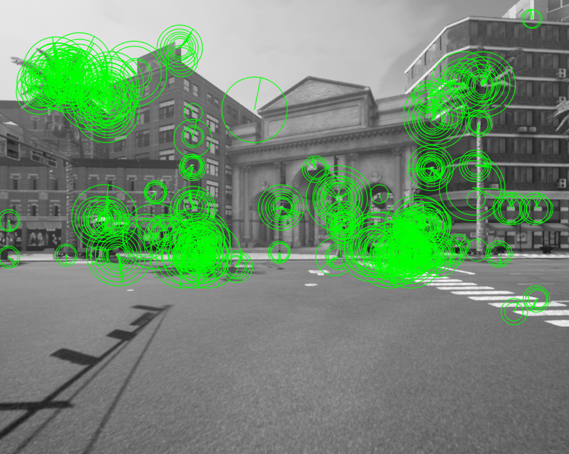
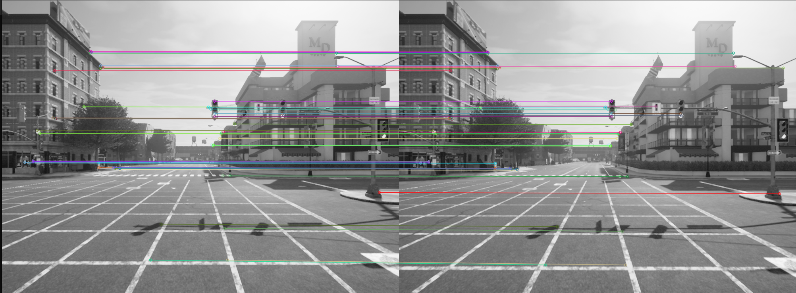
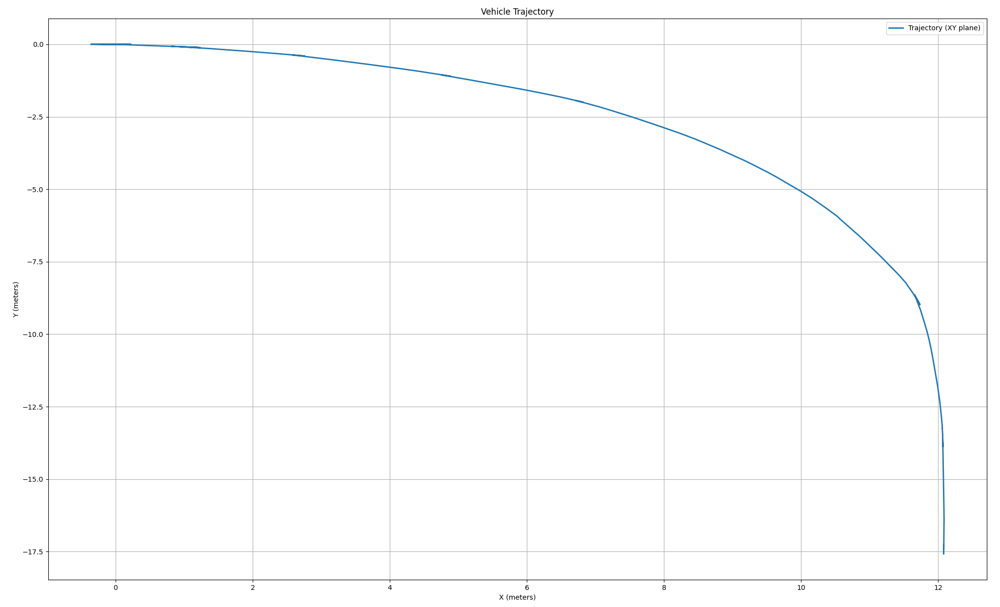
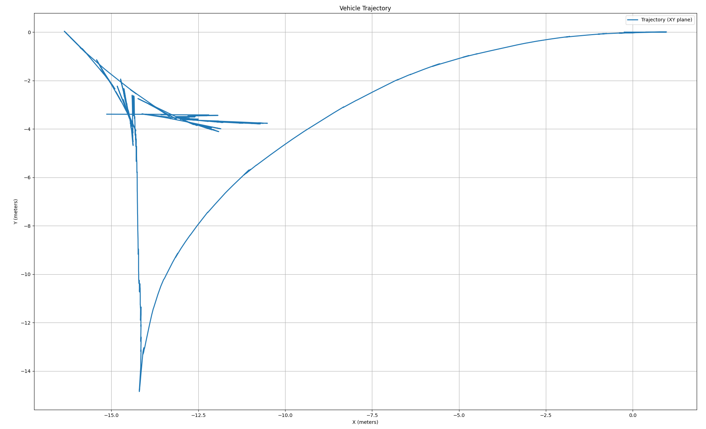

# Inertial - Visual Odometry for CARLA Simulator

## Overview

Visual Odometry for CARLA Simulator is a Python package designed to estimate the motion of a vehicle within the CARLA simulator using monocular camera inputs and IMU datas. The package implements a visual odometry algorithm that processes camera frames to compute the relative transformation between consecutive frames, providing localization in simulated environments. To fuse IMU data and visual odometry, complimentart filter algorithm is used. Ignoring lateral movement on visual odometry because it contians noises to calculate. 

## Features

* Monocular camera-based visual odometry.
* Real-time processing and compatibility with CARLA simulator.
* Highly customizable for different camera configurations.
* OpenCV-powered feature detection, matching, and motion estimation.
* Easy-to-integrate with CARLA's API for seamless simulation workflows.
* Includes tools for visualization and debugging.

# Requirements

* Python 3.8+
* CARLA Simulator (v0.9.x or later recommended)
* Required Python libraries:

        numpy
        opencv-python
        matplotlib
        carla

Features extraction results using opencv ORB method.

Feature matching using "cv2.BFMatcher(cv2.NORM_HAMMING, crossCheck=True)"

short-distance results

long distance result. It is obvious that the trajectory drifts over time because of lack of features or wrong matchings. The localization system evetually needs a global localization system (GNSS or SLAM algorithm)

# TODOs

* Improving fusion algorithm (kalman filter or other methods)
* Attempting visual odometry outputs in different weather conditions
* Bundle adjustment method can be used to map enviroment (Visual SLAM implementation)
* In long distance, the vehicle visual odometry drifts over time. More stable algorithm can be used in matching and motion estimation.
* scaling can be used to calculate outputs.